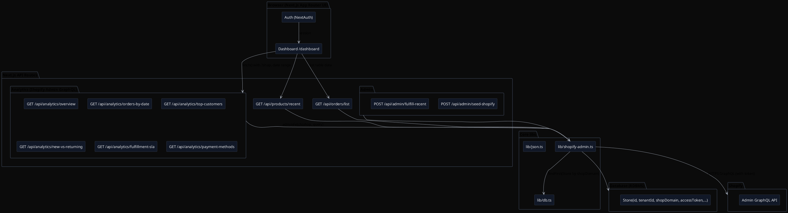

# Xeno Shopify Multi‑Tenant Data Ingestion & Insights

A Next.js app that connects to Shopify Admin GraphQL for multi‑tenant analytics and (optionally) ingests data into a relational DB via Prisma. The dashboard renders Shopify‑backed metrics (not mock DB data): totals, orders‑by‑date, top customers, plus compact insights and a live orders table with filters.

## What’s inside
- **Multi‑tenant**: stores isolated by `shopDomain`; tokens stored per store in DB or env
- **Auth**: Email sign‑in via NextAuth
- **APIs (Shopify Admin GraphQL)**:
  - `GET /api/analytics/overview` — totals (products, customers, orders, GMV, AOV)
  - `GET /api/analytics/orders-by-date` — time series for orders & revenue
  - `GET /api/analytics/top-customers` — top customers by spend
  - `GET /api/analytics/new-vs-returning` — breakdown using Shopify customers+orders
  - `GET /api/analytics/fulfillment-sla` — fulfillment status split & median SLA
  - `GET /api/analytics/payment-methods` — payment method usage
  - `GET /api/products/recent` — recent products
  - `GET /api/orders/list` — filtered, paginated orders list (search/status/sort)
- **Admin actions**:
  - `POST /api/admin/seed-shopify` — seed realistic customers+orders (safe, idempotent)
  - `POST /api/admin/fulfill-recent` — fulfill a % of recent orders over last N days
- **Dashboard**: KPIs, trends, compact insights, recent products, top customers, live orders
- **DB/ORM**: Prisma client, BigInt‑safe JSON helper if you return DB entities

## Quick start
1) Install dependencies
```bash
pnpm install
```

2) Set environment
- Provide Shopify Admin tokens for each tenant either in DB (`Store.accessToken`) or env:
  - `SHOPIFY_TOKEN_TENANT_A_DEMO_MYSHOPIFY_COM="shpat_..."`
  - `SHOPIFY_TOKEN_TENANT_B_DEMO_MYSHOPIFY_COM="shpat_..."`
  - or fallback `SHOPIFY_ACCESS_TOKEN="shpat_..."`
- Standard NextAuth and database envs as per your setup.

3) Dev server
```bash
pnpm dev
```
Open `/dashboard?shop=tenant-a-demo.myshopify.com` (or tenant B).

## How multi‑tenancy works
- Each request includes the `shop` query param (e.g., `tenant-a-demo.myshopify.com`).
- `src/lib/shopify-admin.ts` resolves an Admin access token per shop. It reads from DB first (table `Store`), then falls back to env (`SHOPIFY_TOKEN_${SHOP}`) or `SHOPIFY_ACCESS_TOKEN`.
- All analytics endpoints call Shopify Admin GraphQL directly; results are not faked.

## Key routes
- Shopify analytics:
  - `src/app/api/analytics/overview/route.ts`
  - `src/app/api/analytics/orders-by-date/route.ts`
  - `src/app/api/analytics/top-customers/route.ts`
  - `src/app/api/analytics/new-vs-returning/route.ts`
  - `src/app/api/analytics/fulfillment-sla/route.ts`
  - `src/app/api/analytics/payment-methods/route.ts`
- Orders list (table data):
  - `src/app/api/orders/list/route.ts`
- Admin utilities:
  - `src/app/api/admin/seed-shopify/route.ts`
  - `src/app/api/admin/fulfill-recent/route.ts`
- Dashboard UI:
  - `src/app/dashboard/page.tsx`

## Dashboard features
- Date range quick picks (7/14/30d) and custom range
- KPIs: products, customers, orders, GMV, AOV
- Orders & revenue chart (orders, revenue, AOV line)
- Compact cards: New vs Returning, Fulfillment split + median SLA
- Panels: Recent products and Top customers (counts matched)
- Live Orders table: search (email/order id), status filter, sort, pagination

## Shopify scopes
- Required: `read_orders`, `read_customers`, `read_products`
- For >60 days order history, add: `read_all_orders`

## Error handling
- Robust GraphQL error surfacing in `adminFetch`
- Fulfillment mutations use correct inputs (`fulfillmentCreateV2` without `locationId` in V2 input)
- Queries use `displayFulfillmentStatus` instead of removed `fulfillmentStatus`

## Database
- Prisma models include `Store` with unique `(tenantId, shopDomain)`; tokens can be stored there
- If returning DB entities via API, use `src/lib/json.ts:safeJson` for BigInt‑safe JSON

## Deployment
- Deployed on Vercel (recommended). Ensure environment tokens are set for each tenant.

## Architecture
An overview diagram is included as `public/architecture.jpeg`. If you need to regenerate, use the PlantUML below.

### PlantUML source


## Assumptions
- Shopify Admin access tokens are already generated per tenant store
- Shopify demo stores have seedable customers/orders; products may be created manually
- For the assessment, analytics come from Shopify API (not synthetic DB data)

## Next steps (productionizing)
- Add Bulk Operations for large historical ranges and async ingestions
- Add webhooks (orders/create, customers/create, products/update) to keep DB in sync
- Implement robust rate limiting + retry/backoff around Admin API calls
- Harden multi‑tenant onboarding with OAuth install and token rotation
- Add e2e tests for API routes and dashboard flows

## API reference (selected)
- `GET /api/analytics/overview?shop=&startDate=&endDate=`
- `GET /api/analytics/orders-by-date?shop=&startDate=&endDate=`
- `GET /api/analytics/top-customers?shop=&startDate=&endDate=&limit=`
- `GET /api/orders/list?shop=&startDate=&endDate=&q=&status=&sort=&limit=&after=`
- `POST /api/admin/seed-shopify?shop=&customers=&orders=`
- `POST /api/admin/fulfill-recent?shop=&percent=&days=`

## Known limitations
- Shopify won’t allow backdating `createdAt`; older windows require `read_all_orders`
- Orders table pagination is forward‑only via cursor (Next button)
- For very large stores, prefer Bulk APIs + background jobs

